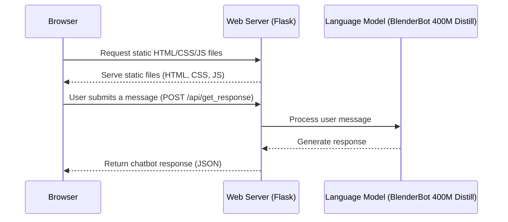

# Chatbot Class Project

This simple K–12 example project demonstrates how to create an online chatbot
using a real language model (like ChatGPT), a Python API, and an HTML/JavaScript/CSS frontend
web page. It serves as a foundational project that can be expanded to explore
additional computer science topics such as file I/O, object-oriented
programming, and data structures, as well as areas like AI, cybersecurity, web
development, databases, and distributed systems.

## Tech Stack

This project uses the following technologies:

- **Browser:** HTML and CSS for website styling, and vanilla JavaScript for web application functionality.
- **Web Server:** Flask, a lightweight Python web server, serves the static HTML, JS, and CSS files, as well as the API endpoints.
- **Language Model:** Facebook's BlenderBot 400M Distill as the core conversational language model.



## Getting Started

### Install the Project


Open the terminal and run the following commands:

1. First, download the project from GitHub:

    ```bash
    git clone https://github.com/GraderThan/ChatbotClassProject.git
    ```

2. Next, install all the required tools to work on the project:

    ```bash
    ./ChatbotClassProject/install
    ```

    > [!WARNING]
    > This will take about 2 minutes to complete the installation.

## Tutorial

By following this tutorial, you'll add a couple of additional pieces to complete the project.

### Frontend Development

In this section, we will briefly walk through the frontend development.

#### **1. Open Web Preview Project**

1. Click on the text field named "code" at the top of the screen.
2. In the input field that appears, type the `>` symbol to activate the command palette.
3. In the same input field, type `Web Preview: Open Project` and then press **Enter**.
4. In the new input field, type `ChatbotClassProject/frontend` to open the project's HTML, CSS, and JS files in preview mode.

#### **2. Edit the HTML**

In the window labeled `index.html`, add the `<h1>` and `<div>` elements from the following code at the top of the `body` element to give your web page a title and a space to display messages:

```html
<body>
    <h1>Chatbot WebApp</h1>
    <div id="chatbox"></div>
    ...
</body>
```

> [!TIP]
> Encourage your students to add additional HTML elements for personalization and customization.

#### **3. Edit the CSS**

In the window labeled `style.css`, add the following code to the top of the file:

```css
body {
    font-family: Poppins, Arial, sans-serif;
    margin: 20px;
    background-color: #eeeeee;
}

h1 {
    color: #333;
}

#chatbox {
    border: 1px solid #070D59;
    padding: 10px;
    height: 400px;
    border-radius: 15px;
    overflow-y: scroll;
    display: flex;
    flex-direction: column;
}
```

> [!TIP]
> Feel free to experiment by changing the existing and new styles, allowing your students to personalize the application to their liking.

#### **4. Test It Out**

Try typing some text in the text field at the bottom and view the output. There's an error because the backend is not running yet. Take this time to perform any last-minute style touch-ups before we shift over to the backend.

### Backend Development

In this section, we will interact with the language model locally, then complete the server so our frontend can receive messages from the language model.

> [!IMPORTANT]
> Before you start, if you have not done so already, close the preview project:
> 1. Click on the text field named "code" at the top of the screen.
> 2. In the input field that appears, type the `>` symbol to activate the command palette.
> 3. In the same input field, type `Web Preview: Close Project` and then press **Enter**.

#### **1. Run the Chatbot**

1. Open the file `chatExample.py`.
2. Press the play button in the upper right corner of the screen.
3. In the console at the bottom of the screen, converse with the chatbot.

> [!NOTE]
> You will notice the application does not maintain a history of the conversation. If you are interested in expanding your AI or data structures activities, this is a great place to start. [Look at this example for more information](https://huggingface.co/docs/transformers/main/en/model_doc/blenderbot#transformers.BlenderbotForConditionalGeneration.forward.example).

> [!TIP]
> This is a real language model made by Facebook, similar to how ChatGPT is made by OpenAI. This model is running on your Grader Than Workspace; you can find all the files at `~/.cache/huggingface/hub/models--facebook--blenderbot-400M-distill`. Feel free to explore over 400,000 more AI models at [https://huggingface.co/](https://huggingface.co/).

#### **2. Start the Server**

1. Open the file `app.py`.
2. Copy lines 17–22 from `chatExample.py` and replace line 29 in `app.py` with them:

    ```python
    inputs = tokenizer([user_input], return_tensors="pt")

    reply_ids = model.generate(**inputs)
    response = tokenizer.decode(reply_ids[0], skip_special_tokens=True)
    ```

3. Run the server by opening the file `app.py` and pressing the play button in the upper right corner.

> [!NOTE]
> You will notice the server has no authentication. This is an excellent opportunity to explore cybersecurity principles. Additionally, if you add chatbot history, you have the chance to delve into file I/O or databases.

#### **3. Access the Website**

1. Copy the URL of your current browser tab.
2. Open a new browser tab and paste the copied URL.
3. Replace `ide` at the beginning of the URL with `5000`.
4. Press **Enter**.