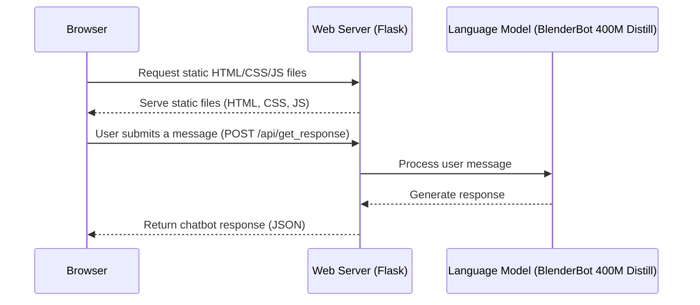

# Chatbot Class Project

This simple K12 example project demonstrates how to create an online chatbot
using a real language model, a Python API, and an HTML/JS/CSS frontend web page.
It serves as a foundational project that can be expanded to explore additional
computer science topics such as file I/O, object-oriented programming, and data
structures, as well as areas like AI, cybersecurity, web development, databases,
and distributed systems. 

## Tech Stack

This project uses the following technologies:

- **Browser:** HTML and CSS for website styling and vanilla JavaScript for web
  application functionality. 

- **Web Server:** Flask, a lightweight Python web server, will serve the static
  HTML, JS, and CSS files, as well as the API endpoints. 

- **Language Model:** Facebook's BlenderBot 400M Distill as the core
  conversational language model.



## Getting Started

Open the terminal and run the following commands:

1. First we need to download the project from github

    ```
    git clone https://github.com/GraderThan/ChatbotClassProject.git
    ```

2. We need to install all the required tools in order work on the project.

    ```
    ChatbotClassProject/install
    ```

    > [!WARNING]  It may take a while to install
    > This will take about 5 minutes to complete the installation.

3. Run the server open the file `app.py` and press the play button in the upper 